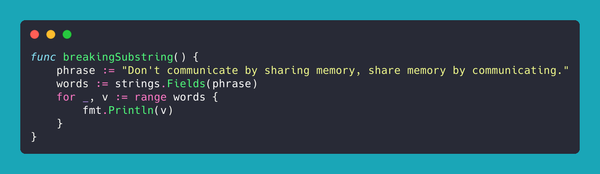
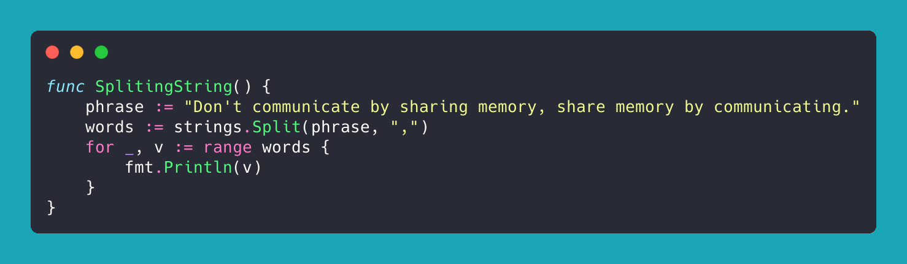
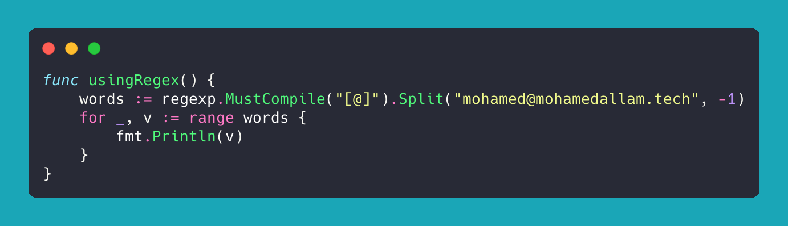

When working with strings and text, many times we decide to cut the strings to wrods but then what a word is, and also what is going to be considered a seperator.
This factors are so important for us to make a decision, but lets take a closer look at the commen ways

### Breaking strings

The simple impelemntation of fields do seperate a word by a whitespace.
white spaces will be accordring to the [unicode.IsSpace](https://cs.opensource.google/go/go/+/refs/tags/go1.20.2:src/unicode/graphic.go;l=128)
`'\t', '\n', '\v', '\f', '\r', ' ', U+0085 (NEL), U+00A0 (NBSP).`
The function can be [found here](https://pkg.go.dev/unicode#IsSpace).

``` go
func breakingSubstring() {
    phrase := "Don't communicate by sharing memory, share memory by communicating."
    words := strings.Fields(phrase)
    for _, v := range words {
        fmt.Println(v)
    }
}
```

This will print out
\>**Don't**
**communicate**
**by**
**sharing**
**memory,**
**share**
**memory**
**by**
**communicating.**



### Split a string using a "splitter"

Split, slices the string, by the definied seperator as a second argument, and returns all the substrings between those separators
If sep is empty, Split splits after each UTF-8 sequence.

``` go
func SplitingString() {
    phrase := "Don't communicate by sharing memory, share memory by communicating."
    words := strings.Split(phrase, ",")
    for _, v := range words {
        fmt.Println(v)
    }
}
```

> **Don't communicate by sharing memory**
>  **share memory by communicating.**



### Using regex pattern matching

For this simple example, I demonstrate how using a Regex to split an email from the domain.

``` go
func usingRegex() {
    words := regexp.MustCompile("[@]").Split("mohamed@mohamedallam.tech", -1)
    for _, v := range words {
        fmt.Println(v)
    }
}
```

> **mohamed**
>  **mohamedallam.tech**


