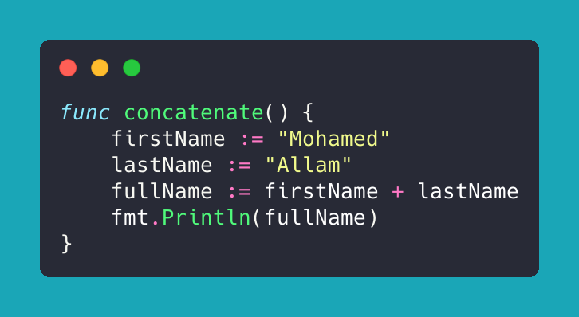

In [Golang](../../Golang.md), [string](../String.md) are
in Go, concatenating strings is fairly easy and straight forward, you simply use the add or addition symbol and you are all set. and here is an example



``` go
func concatenate() {
    firstName := "Mohamed"
    lastName := "Allam"
    fullName := firstName + lastName
    fmt.Println(fullName)
}
```

Or you can [try it yourself](https://go.dev/play/p/g75JTwTH-xq)

Strings are arrays, so you can use indexing as well,

``` go
firstName := "Mohamed"
firstLetter := firstName[0] // returns M
lnFirstLetter := "Allam"[0] // return A
```
