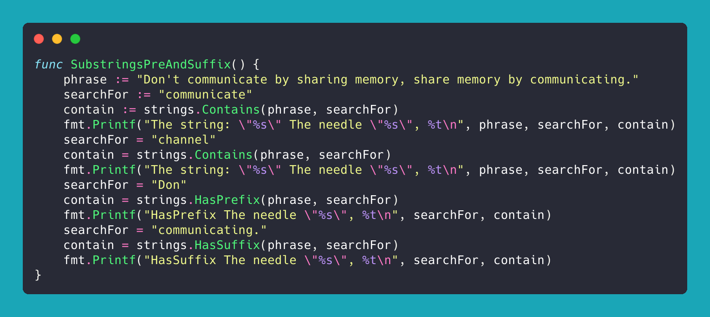

To find a substring in a string its fairly simple, using Go official package, there is several functions,
This functions outlines the functions
- [Contains](https://pkg.go.dev/strings#Contains)
- [HasPrefix](https://pkg.go.dev/strings#HasPrefix)
- [HasSuffix](https://pkg.go.dev/strings#HasSuffix)

They all return a boolean, to determine wether the substring exists or not

``` go
func SubstringsPreAndSuffix() {
    phrase := "Don't communicate by sharing memory, share memory by communicating."
    searchFor := "communicate"
    contain := strings.Contains(phrase, searchFor)
    fmt.Printf("The string: \"%s\" The needle \"%s\", %t\n", phrase, searchFor, contain)
    searchFor = "channel"
    contain = strings.Contains(phrase, searchFor)
    fmt.Printf("The string: \"%s\" The needle \"%s\", %t\n", phrase, searchFor, contain)
    searchFor = "Don"
    contain = strings.HasPrefix(phrase, searchFor)
    fmt.Printf("HasPrefix The needle \"%s\", %t\n", searchFor, contain)
    searchFor = "communicating."
    contain = strings.HasSuffix(phrase, searchFor)
    fmt.Printf("HasSuffix The needle \"%s\", %t\n", searchFor, contain)
}
```

You can [try it yourself](https://go.dev/play/p/ual7bVxCjdg)

## under the hood

### Contains function explained

The Contains function simply checks whether the string has a given substring.
Using the [index function](https://cs.opensource.google/go/go/+/refs/tags/go1.20.2:src/strings/strings.go;l=1178) [Contains function](https://cs.opensource.google/go/go/+/refs/tags/go1.20.2:src/strings/strings.go;l=58) uses [index](https://pkg.go.dev/strings#Index) function to determine wether or not the substring exits.
When provided with a string, the contains pass it to the index function, so if substring is present it returns a greater than -1, the Contains function returns true. otherwise it s false

``` go
func Contains(s, substr string) bool {
    return Index(s, substr) >= 0
}
```

### Has (Prefix/Suffix) function explained

Contrary to the containts, the strings package uses a different implemenration for the [HasSuffix](https://cs.opensource.google/go/go/+/refs/tags/go1.20.2:src/strings/strings.go;l=455) and [HasPrefix](https://cs.opensource.google/go/go/+/refs/tags/go1.20.2:src/strings/strings.go;l=450) functions, have two actions:
- It first checks the length of both strings (needle and haystack), then it performs a comparison, if the comparison is satisfieid, the substring is shorter or equal to the string,
- It performs the required part to be checked for existstence or negation.

``` go
func HasSuffix(s, suffix string) bool {
    return len(s) >= len(suffix) && s[len(s)-len(suffix):] == suffix
}
func HasPrefix(s, prefix string) bool {
    return len(s) >= len(prefix) && s[0:len(prefix)] == prefix
}
```
